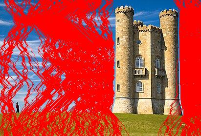
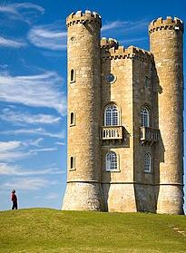

# Seam Carving OOP

Seam Carving is an advanced image resizing algorithm that intelligently removes pixels to maintain the most important content in an image. This project implements Seam Carving using an **Object-Oriented Programming (OOP)** approach in Python.

## Features
✅ Object-Oriented Implementation for modularity and reusability  
✅ Computes energy maps to identify the least important pixels  
✅ Uses dynamic programming to find and remove seams  
✅ Supports both **vertical** and **horizontal** seam removal  
✅ Saves the resized image and a seam visualization image  

## Installation
Make sure you have Python installed (Python 3.7+ recommended). You can install the required dependencies using:

```bash
pip install numpy pillow
```

## Usage

### 1️⃣ Run the Script
Save an image in the project folder (e.g., `test.png`) and run:
```bash
python seam_carving.py
```

### 2️⃣ Import and Use the `SeamCarver` Class
You can also use the SeamCarver class in your own Python scripts:
```python
from seam_carving import SeamCarver
from PIL import Image

# Load image
image = Image.open("test.png").convert("RGB")

# Create SeamCarver object
carver = SeamCarver(image)

# Resize image
resized, seams_visualization = carver.carve(target_width=image.width//2, target_height=image.height//2)

# Save results
resized.save("resized.jpg")
seams_visualization.save("seams.jpg")
```

## Example
Original Image → Seam Visualization → Resized Image  
 →  → 

## How It Works
1. **Compute Energy Map**: Uses gradients to determine pixel importance.  
2. **Find Seam**: Uses dynamic programming to locate the least significant seam.  
3. **Remove Seam**: Deletes the seam and shifts pixels accordingly.  
4. **Repeat**: Iteratively removes seams until the desired size is reached.  

## Contributing
Feel free to fork this repository and submit pull requests with improvements! 🚀

## License
This project is open-source and available under the **MIT License**.

---

